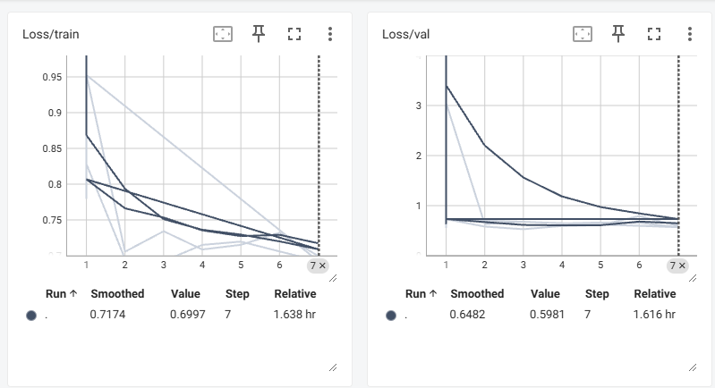

# **ResNet Binary Classification Project**

This project implements a binary classification model using a ResNet architecture to classify images into two categories (e.g., cats and dogs). The project includes data preprocessing, model training, evaluation, and visualization using TensorBoard.

---

## **Table of Contents**
1. [Setup and Installation](#setup-and-installation)
2. [Dataset](#dataset)
3. [Preprocessing](#preprocessing)
4. [Model Design](#model-design)
5. [Training](#training)
6. [Evaluation](#evaluation)
7. [Challenges and Solutions](#challenges-and-solutions)
8. [How to Run](#how-to-run)

---

## **Setup and Installation** <a name="setup-and-installation"></a>
### **Installation**
1. Clone the repository:
   ```bash
   git clone https://github.com/MostafaElgawad/Binary-ResNET
   cd Binary-ResNET
   ```

2. Create a virtual environment and install dependencies:
    ```bash
    python -m venv venv
    source venv/bin/activate  # On Windows: venv\Scriptsctivate
    pip install -r requirements.txt
    ```

---

## **Dataset** <a name="dataset"></a>
### **Dataset Description**
The original dataset contains images of cats, dogs, and horses. However, for the binary classification task, we have selected only the images of cats and dogs.

### **Dataset Source**
The dataset is available on [Kaggle](https://www.kaggle.com/datasets/arifmia/animal/data).

---

## **Preprocessing** <a name="preprocessing"></a>
1. **Resize Images**: All images are resized to 64x64 pixels.

2. **Convert to Grayscale**: Images are converted to grayscale to reduce complexity.

3. **Normalization**: Pixel values are normalized to the range [0, 1].

4. **Data Augmentation**: Random horizontal flips, rotations, and color jittering are applied to the training set to improve generalization.

---

## **Model Design** <a name="model-design"></a>
### **ResNet Architecture**
The model is based on the ResNet architecture with the following modifications:
    
1. **Input**: 1-channel grayscale images (64x64).
2. **Output**: Binary classification (cat or dog).
3. **Layers**:
    * Five residual blocks with skip connections.
    * Fully connected layer with a single output (logit for binary classification).
    
---

## **Training** <a name="training"></a>
### **Training Setup**
* **Loss Function**: Binary Cross-Entropy Loss (BCEWithLogitsLoss).
* **Optimizer**: Adam optimizer with a learning rate of 0.001.
* **Epochs**: 50.
* **Batch Size**: 32.

---

## **Evaluation** <a name="evaluation"></a>
### **Results**


### **Interpretation**
* The model performs well for dogs but poorly for cats due to class imbalance.
* Precision for cats is high, but recall is very low, indicating that the model rarely predicts cats.

---

## **Challenges and Solutions** <a name="challenges-and-solutions"></a>
### **Architecture Depth Challenge**:
The original architecture was primarily designed for smaller images (32x32), but in our case, the images are of a larger size (64x64). To address this, I added a fifth layer to the network rather than increasing the density of the feedforward layers. This helped balance the computational complexity and model capacity, allowing the architecture to handle the larger image size more effectively.
    
### **Dataset Size and Imbalance**:
The dataset was relatively small and imbalanced, which could lead to poor model generalization. To mitigate this, I implemented data augmentation techniques to artificially increase the dataset size. Additionally, I should have used a weighted binary cross-entropy loss to address the class imbalance more effectively. To prevent overfitting, I also employed early stopping during training, halting the training when the validation loss no longer improved.

### **Output Predictions and Comparison**:
To ensure that the output predictions are binary, I configured the model to output a single class instead of multiple classes. This allowed the predictions to match the targets in size (batch size), simplifying the comparison between predicted values and true labels.

---

## **How to Run**
After following the [Setup and Installation](#setup-and-installation) instructions, follow the guidelines in the `main.ipynb` file.

For visualizing the results:
   ```bash
   tensorboard --logdir=logs
   ```
Open your browser and go to [http://localhost:6006](http://localhost:6006).
